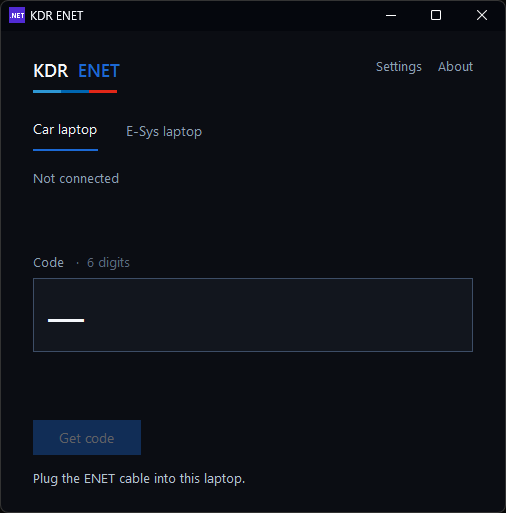
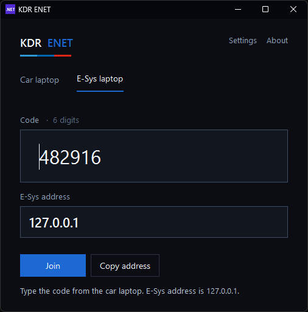
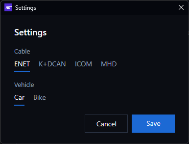

# KDR ENET

Remote **BMW** coding with a session code.

The laptop on the car and the laptop running E-Sys do not need the same Wi-Fi. The car side shows a 6-digit code. The E-Sys side types it. E-Sys uses `127.0.0.1`.

**[Download KdrEnet.exe](https://github.com/kdrcoding/kdr-enet/releases/latest)** · Windows 10 or 11, 64-bit · click **Yes**

You do not install .NET. It is already inside the download. The app itself does not need a driver to open.

  
  &nbsp;&nbsp;
  

## Car laptop · with the BMW

1. Open KDR ENET → **Car laptop**
2. Cable in. Ignition on. Wait until the module is awake
3. **Get code** — read the six numbers out loud
4. Leave this window open

Cables for the session: **ENET**, **MHD**, **ICOM**.

## E-Sys laptop

1. Open KDR ENET → **E-Sys laptop**
2. Type the code in the **6 boxes** → **Join**
3. In E-Sys set the address to `127.0.0.1`
4. Leave this window open

**Stop** on both laptops when the coding is done.

## Settings

  

Pick the cable and **Car** or **Bike**.

K+DCAN only shows that the USB cable is plugged in. The code session is for ENET, MHD, and ICOM.

## Cable driver

Windows 10 and 11 usually already have the cable driver. If the cable is plugged in and the app still says the driver is missing, click **Open driver page** in the app.

- K+DCAN, FTDI chip: [FTDI VCP driver](https://ftdichip.com/drivers/vcp-drivers/)
- K+DCAN, CH340 chip: [WCH CH340 driver](https://www.wch-ic.com/downloads/CH341SER_EXE.html)
- ENET, ASIX chip: [ASIX driver](https://www.asix.com.tw/en/support/download)
- ENET, Realtek chip: [Realtek downloads](https://www.realtek.com/en/downloads)

The E-Sys laptop does not need a cable driver.

## Before you start

- First open: read the terms → **I agree**
- **Awake** means the module answered. It is not a battery voltage
- If **Get code** says the session server is not set, that code cannot reach the other laptop yet

KDR ENET is an independent tool for a remote BMW session. Not affiliated with BMW.

Created by Kadir · [kdrcoding.com](https://kdrcoding.com) · support@kdrcoding.com
