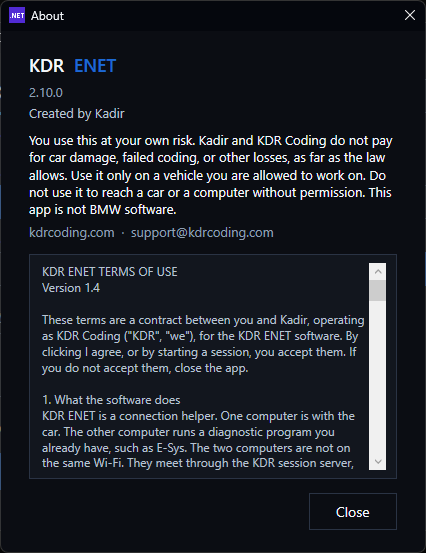

# KDR ENET

One laptop stays with the car. The other laptop runs E-Sys, anywhere. They do not need the same Wi-Fi.

  

  <b>Click the blue button. That downloads KdrEnet.exe.</b> 
  Windows 10 or 11, 64-bit. Click <b>Yes</b> when Windows asks. .NET is already inside the file.

Both laptops run this same app. The first time, read About and click **I agree**.

From this version on, the app checks GitHub when it opens. If a newer version is there, it downloads that file and opens it. Click **Yes** if Windows asks. A session that is already open waits until **Stop**.

## Why this app

**The car laptop is the bridge.** On Radmin VPN, Start listens on this laptop and passes E-Sys traffic straight to the cable. The packets do not go through the San Jose server. That is the fast path when the two laptops are closer to each other than they are to California.

**Small packets are not held.** The bridge sends each E-Sys packet as soon as it arrives. Windows is not asked to wait and bundle them. That is what keeps a coding session from feeling sticky.

**Windows Firewall stays on.** Start does not turn the firewall off. It allows only the diagnostic ports for this session: TCP 6801, 13400, and 50160, and UDP 6811 and 13400. The other laptop can reach the car through those ports. The rest of this computer stays closed. **Stop** removes that allow rule. Some other tools turn the whole firewall off so any inbound traffic is accepted. This app does not.

**One window.** The sentence under the buttons tells you the next click. Close to the server, use the 6-digit code. Far away, use the Radmin VPN address. You do not install .NET.

## KDR server

Use this when the number at the top is low, such as 50 ms.

**Car laptop**

1. Cable in. Ignition on. The window shows the VIN. Year and make come from that VIN. The model is added when the VIN decodes cleanly. Wait until the bottom line says the car is awake.
2. Click **Get code**. It stays until **Stop**. **New code** replaces it. The window stays **Not connected** until someone joins, then **Connected** turns green. If they leave, it goes back to **Not connected**. On this path their home address is not visible. The car year, type, and VIN sit with that line once the code is up.
3. Read the 6 numbers to the other person. Leave this window open.

**E-Sys laptop**

1. Click **E-Sys laptop**.
2. Type the 6 numbers. Click **Join**.
3. The window says **Identifying**, then **Found** and connects, or **Not found**.
4. In E-Sys use the address the window shows, `tcp://127.0.0.1:6801`. Leave this window open.

  
  &nbsp;&nbsp;
  

## Radmin VPN

Use this when the top line says the server is far, or when both laptops already share a Radmin VPN network.

1. On both laptops, click **Open Radmin VPN** and join the same network.
2. On the car laptop, click **Radmin VPN**. **Copy** sits next to **Start** and copies the address, such as `tcp://26.x.x.x:6801`.
3. Click **Start**. The window stays **Not connected** until the other laptop reaches this one. Then **Connected from** that laptop's Radmin address turns green. If they leave, it goes back to **Not connected**.
4. On the E-Sys laptop, paste that address into E-Sys.

**Open Radmin VPN** starts Radmin VPN. It does not start Radmin Viewer. Radmin VPN is a program you install yourself. This app does not include it.

Windows Firewall stays on. Start allows the diagnostic ports. **Stop** removes that allow rule. If an older session left the firewall off, **Stop** turns the previous settings back on.

## When you are done

Click **Stop** on both laptops.

The bottom line names what is missing. **Awake** means the module answered. It is not a battery voltage.

## Settings

  

The code session is for **ENET**, **MHD**, and **ICOM**. **K+DCAN** only shows that the USB cable is plugged in.

If the cable is plugged in and the app says the driver is missing, click **Open driver page**.

- [FTDI](https://ftdichip.com/drivers/vcp-drivers/) for many K+DCAN cables
- [CH340](https://www.wch-ic.com/downloads/CH341SER_EXE.html) for other K+DCAN cables
- [ASIX](https://www.asix.com.tw/en/support/download) for many ENET cables
- [Realtek](https://www.realtek.com/en/downloads) for some ENET cables

The E-Sys laptop does not need a cable driver.

## About

You use KDR ENET at your own risk, and only on a vehicle you are allowed to work on. It does not include E-Sys, BMW software, or Radmin VPN. It is not made by BMW.

  

Created by Kadir · [kdrcoding.com](https://kdrcoding.com) · support@kdrcoding.com
